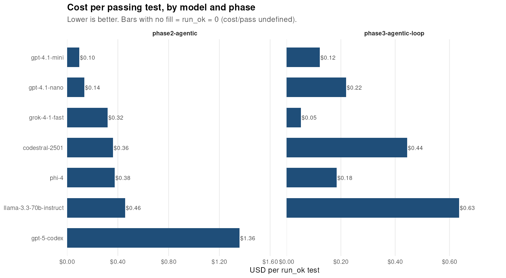
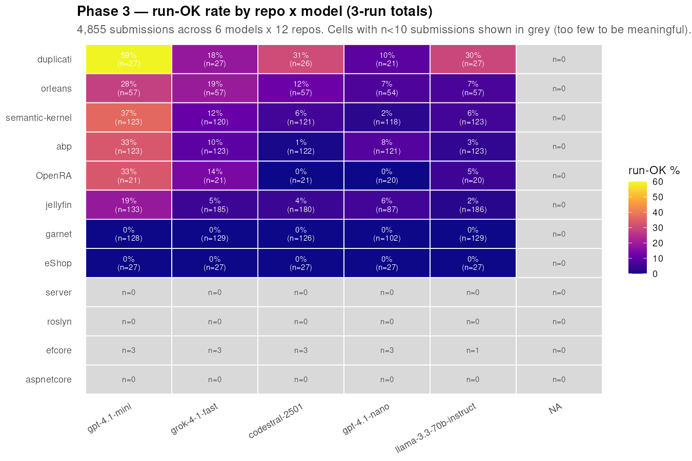
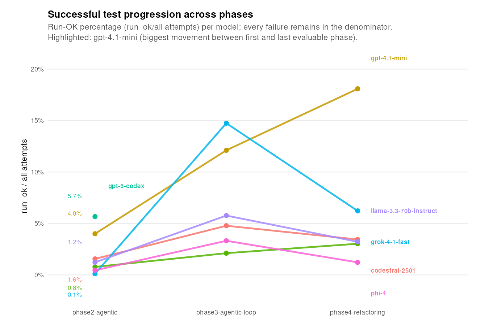
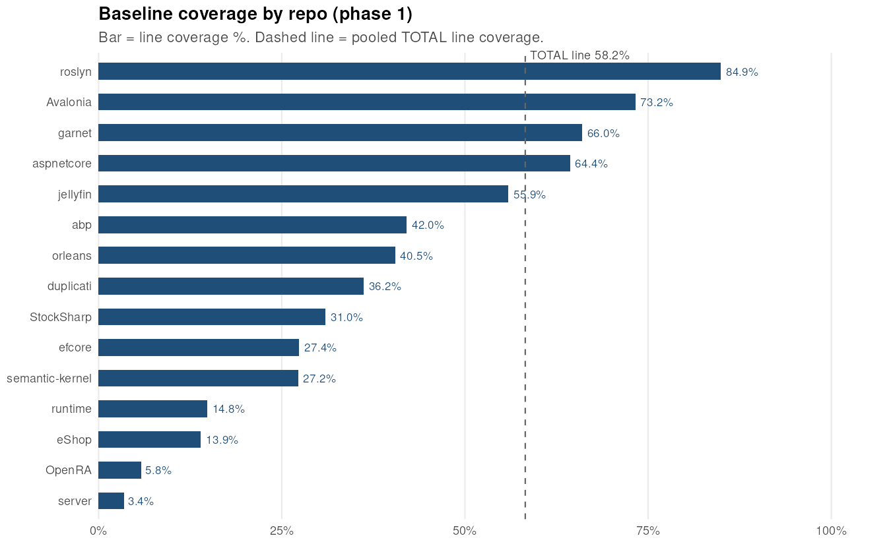

# mocking-static-methods

Experiment in generating unit tests and mocks for code containing static method calls.

## Experimental design

The experiment progresses in phases. Each phase fixes the input set and varies one thing — the test-generation strategy — so we can attribute coverage gains and failure modes to that strategy.

| Phase | Strategy | Status |
|---|---|---|
| 1 — baseline | No generation. Measure existing test suites. | ✅ sealed · [REPORT](phases/phase1-baseline/REPORT.md) |
| 2 — single agent, no feedback | One agent with `read_file` / `list_dir` / `submit_test` tools, max 6 turns. The agent can explore the repo before submitting, but never sees its own compile or test output. | ✅ v2 sweep complete (300 cells × 3 runs × 7 models = 6,300 attempts) · [HEADLINE](phases/phase2-agentic/HEADLINE.md) · [REPORT](phases/phase2-agentic/REPORT.md) · [COSTS](phases/phase2-agentic/COSTS.md) · [REPLICATION](phases/phase2-agentic/REPLICATION.md) |
| 3 — agentic loop | Same single agent as phase 2, but compile errors **and `dotnet test` results** are fed back as additional turns so the agent can fix its own output (up to 4 submissions per cell). | ✅ v2 sweep complete (300 cells × 3 runs × 6 models = 5,400 attempts) · [HEADLINE](phases/phase3-agentic-loop/HEADLINE.md) · [REPORT](phases/phase3-agentic-loop/REPORT.md) · [COSTS](phases/phase3-agentic-loop/COSTS.md) · [REPLICATION](phases/phase3-agentic-loop/REPLICATION.md) |
| 4 — agentic loop + testability refactoring | The phase-3 single agent, plus an `apply_refactor` tool that can introduce a testability seam (extract-and-override, wrapper interface, dependency parameterization) into the production code before testing it. Isolates the effect of a refactoring *capability* on a fixed input set. | design in progress |
| 5 — multi-agent | Specialist agents (writer / reviewer / fixer) collaborate on each target. | scaffold ([`phase5-multiagent/PLAN.md`](phases/phase5-multiagent/PLAN.md)) |

> Each phase directory contains a **REPORT.md** (narrative + per-model results table), a **COSTS.md** (per-model spend), a **REPLICATION.md** (one-page reproduction recipe), a **phase.lock.yaml** (frozen inputs), and a **results/** tree (raw JSONL + generated tests).

### Cost so far

The full [phase 2 v2 sweep](phases/phase2-agentic/) — 7 models × 300 cells × 3 runs = 6,300 attempts — cost **\$89.98 USD** in token spend (Azure bill ~\$105 including infra). 82% of the bill (\$73.40) was `gpt-5-codex`, which has since been removed from the panel and from Azure AI Foundry for phases 3-5. The remaining 6-model panel costs ~\$0.018 per attempt. See [phases/phase2-agentic/COSTS.md](phases/phase2-agentic/COSTS.md) for the per-model breakdown and projections for the next tiers.



*Cost per passing generated test, by model. `gpt-5-codex` was the most expensive per attempt and the reason it was dropped from the panel for phases 3+.*

### Phase 3 — agentic loop with compile + run feedback (final, 3 runs)

The phase 3 sweep ran the same 300 v2 targets, three runs, against the same 6-model panel as phase 2 (no codex), with one structural change: after every `submit_test` the runner does `dotnet build` AND `dotnet test`, then feeds either the compile errors or the failing-test messages back to the model. The model gets up to 4 submission attempts per cell. These are **canonical evaluator numbers** (`evaluation.jsonl` from the dedicated evaluator workflow that builds each test against the real production csproj).

| Model | Cells (n) | Submitted | Compile-OK | **Run-OK** | Compile% | Run% |
|---|---:|---:|---:|---:|---:|---:|
| `codestral-2501`         | 900 | 855 | 146 |  43 | 16.2% |  4.8% |
| `gpt-4.1-mini`           | 900 | 637 | 173 | 109 | 19.2% | 12.1% |
| `gpt-4.1-nano`           | 900 | 701 |  42 |  19 |  4.7% |  2.1% |
| `grok-4-1-fast`          | 900 | 899 | 240 | **133** | **26.7%** | **14.8%** |
| `llama-3.3-70b-instruct` | 900 | 894 | 121 |  52 | 13.4% |  5.8% |
| `phi-4`                  | 900 | 869 |  65 |  30 |  7.2% |  3.3% |
| **TOTAL**                | **5,400** | **4,855** | **787** | **386** | **14.6%** | **7.1%** |



*Run-OK rate by repo × model, all three phase 3 runs combined (4,855 submissions). Two "fortress" repos (`aspnetcore`, `server`) sit at 0% across every model, and `eShop` is the inverse (tests compile but none run). Cells with fewer than 10 submissions are masked grey and labeled with N only — `efcore` has just one v2 target so every cell is a 3-attempt coin flip, and `gpt-4.1-mini × roslyn` only landed 4 submissions; reading a percentage off any of those would be noise.*

Two takeaways:

1. **The compile-vs-run gap is the headline number.** 787 cells compiled but only 386 ran successfully — roughly half of tests that build cleanly still fail at runtime (assertion failures, thrown exceptions, hung tests with no `[Fact]` actually executed, etc). This is the "compiles but doesn't run" failure mode that motivated routing test-runner output back into the loop, and the run-OK column is what the rest of the phase will optimise.
2. **Compile-OK ≈ 3.0× phase 2; run-OK ≈ 5.1× phase 2.** Phase 2 (single shot, no feedback) hit 4.8% compile / 1.4% run across the same 6-model panel on this target set (259 / 75 out of 5,406 cells). Phase 3 (3 runs/cell with in-loop compile + run feedback) hits 14.6% compile / 7.1% run on 5,400 cells — i.e. the in-loop feedback buys real ground at a strict pareto improvement: 5.1× more passing tests for 4.96× the spend, same cost-per-green-test ($0.213 vs $0.221).



*Run-OK rate per model across phase 2 (no feedback) and phase 3 (compile + run feedback in-loop). Every model in the panel gains; `grok-4-1-fast` and `llama-3.3-70b-instruct` gain the most.*

> **Note on the two compile counts.** The runner's in-loop sandbox (which decides what feedback to give the model) is more conservative than the canonical evaluator: it reports a noticeably lower compile+run count on the same attempts. The runner builds in a synthetic standalone csproj for speed; the evaluator builds inside the production csproj where transitive references resolve correctly. The evaluator numbers (787 compile / 386 run-OK) are the headline; the runner numbers are an internal feedback signal. See [phase 3 REPORT § Sandbox discrepancy](phases/phase3-agentic-loop/REPORT.md#sandbox-discrepancy).

Cost is well under the \$250 tripwire ($82.19 of $250 spent so far).

### Repository layout

```
phases/                  Per-phase snapshots (immutable once sealed)
  _template/             Skeleton for new phases
  phase1-baseline/       Baseline coverage data + REPORT.md + phase.lock.yaml
  phase2-agentic/        Single-agent / no-feedback v2 sweep + REPORT + COSTS + HEADLINE + results/
  ...
targets/                 Versioned input set (which Mode#1 sites to attempt)
  v1/                    Production sites, currently uncovered
  current -> v1          Convenience symlink
tools/                   Global, evolving — analyzers, orchestrator helpers
  coverage_xref/         Cobertura ↔ Mode#1-site cross-reference
  targets/               Builds targets/v{N}/ from analyzer + cobertura output
  repo_search/           GitHub Code Search candidate finder
.github/workflows/       Global CI — coverage-orchestrator.yml runs the matrix
Mode1Analyzer/           Roslyn analyzer that detects Mode#1 static-call sites
RESULTS.md               Cross-phase comparison table (the headline scoreboard)
```

**Tooling lives outside `phases/` and evolves freely.** Each phase pins the SHAs it ran against in its own `phase.lock.yaml`, so reproducibility is anchored by the lock file, not by frozen tooling copies. This avoids back-porting bug fixes into N phase directories every time we improve an analyzer.

**Inputs live in versioned `targets/`.** Every phase reads the same `targets.csv` (or pins to an earlier `v{N}`), so cross-phase deltas reflect generation strategy, not target-set drift.

### Why we target only uncovered sites

The phase 1 baseline detected 5,154 Mode #1 static-call sites in production code across 15 repos. 1,087 (21.1%) are already line-covered by the existing test suites. The input set in [`targets/v1/targets.csv`](targets/v1/targets.csv) deliberately excludes those, scoping each later phase to **3,147 sites that are not currently covered**. The headline metric for each phase is:



*Phase 1 baseline coverage by repository. The target set is the uncovered remainder; phases 2+ aim to convert dark bars into light ones with generated tests.*


> "Of the 3,147 targets, how many did this phase newly cover with a passing generated test?"

Including already-covered sites would dilute that signal — generating a test for a covered line cannot move the line-coverage number.

#### How a Mode#1 site can already be "covered" without being mocked

The 1,087 currently-covered sites fall into roughly five buckets, all of which are catalogued in [`targets/v1/covered_sites_analysis.csv`](targets/v1/covered_sites_analysis.csv) for later inspection:

1. **Deterministic, side-effect-free statics** — `Math.Min`, `string.IsNullOrEmpty`, `Guid.NewGuid` (output ignored), `Encoding.UTF8.GetBytes`. The test executes them as-is; no mocking needed.
2. **Real implementation against a controlled fixture** — `HttpClient.GetAsync` covered by `WebApplicationFactory` / `TestServer` (real ASP.NET pipeline against a loopback endpoint), or `File.ReadAllText` covered by writing to `Path.GetTempFileName()` first. Real I/O, controlled inputs.
3. **Configuration / environment statics** — `Environment.GetEnvironmentVariable("FOO")` returning `null` is often the *only* tested branch (the "FOO not set" path); the "FOO is set to a bad value" branch usually requires mocking and is therefore left uncovered. Same pattern for `AppContext.GetData`.
4. **Wrappers behind interfaces, mocked at the seam** — abp's `IClock.Now` / `IGuidGenerator` instead of `DateTime.UtcNow` / `Guid.NewGuid`. The static call site executes only through DI registration of the default wrapper. This is the historical best-practice approach to testing static-method-bearing code, and it will be the model for later phases.
5. **Integration / end-to-end tests** — jellyfin and aspnetcore boot real SQLite, real Kestrel, real file system in temp dirs. Every static call along the request path executes. High coverage, low isolation. As LLMs author more code, we expect this style to dominate over fine-grained unit tests.

#### What we leave on the table by excluding covered sites

Branch-uncovered code around line-covered statics. A generated test for "FOO is set to bad value" can add real value without changing line coverage. That's a separate experiment scoped to a future `targets/v2/` (branch-coverage targets), not merged into v1's input set.

#### What we drop besides covered sites

The Mode #1 analyzer detected 6,321 sites total across the 15 repos. Each lands in exactly one bucket; only the first becomes a target:

| Bucket | Count | In v1 input? |
|---|---:|:---:|
| **production, uncovered, in cobertura** | **3,147** | ✅ **yes — `targets/v1/targets.csv`** |
| production, already line-covered | 1,087 | no — see five buckets above |
| non-production path (test/, samples/, benchmarks/, playground/) | 1,167 | no — out of scope |
| production, `unknown_file` (no cobertura entry — test suite never loaded the assembly) | 901 | no — deferred to v2 |
| production, `unknown_line` (cobertura collapsed a multi-line expression) | 19 | no — data quality |

Per-repo breakdown is in [`targets/v1/README.md`](targets/v1/README.md#per-repo-bucket-breakdown). Full provenance with sha256 of the input is in [`targets/v1/targets.lock.yaml`](targets/v1/targets.lock.yaml).

### Reproducibility contract

Each `phases/phaseN/phase.lock.yaml` records:
- SDK image digest (not just tag)
- Per-repo commit SHAs at run time
- Orchestrator workflow SHA
- Generator workflow SHA + prompt template SHA + model + temperature + seed (for generation phases)
- `targets_version` and `targets_sha256` (the input set — must match what was on disk)
- CI run-ids for both coverage and generation steps

A re-run that produces identical lock-file inputs must produce identical results, modulo LLM nondeterminism (which is itself recorded in `seed`/`temperature`).

## Setup

### Option 1: Dev Container (Recommended)

The easiest way to get started is using the included dev container, which provides all dependencies pre-configured:

1. **Prerequisites:**
   - [Docker Desktop](https://www.docker.com/products/docker-desktop)
   - [VS Code](https://code.visualstudio.com/)
   - [Dev Containers extension](https://marketplace.visualstudio.com/items?itemName=ms-vscode-remote.remote-containers)

2. **Open in container:**
   - Open this folder in VS Code
   - Click "Reopen in Container" when prompted (or use Command Palette: "Dev Containers: Reopen in Container")
   - Wait for container to build and install dependencies

3. **Set up your GitHub token:**
   - Create a `.env` file: `cp .env.example .env`
   - Add your GitHub personal access token
   - Get a token from: https://github.com/settings/tokens

4. **You're ready!** All tools (.NET SDKs, Python, PowerShell, coverage tools) are pre-installed.

### Option 2: Local Installation

If you prefer to run locally without containers:

### Prerequisites
- .NET 8.0 SDK
- Python 3.8+
- GitHub Personal Access Token

### Configuration

1. **Install Python dependencies:**
   ```bash
   pip install -r requirements.txt
   ```

2. **Set up your GitHub token:**
   - Copy the `.env` file and add your GitHub personal access token
   - Get a token from: https://github.com/settings/tokens
   - Edit `.env` and replace `your_github_token_here` with your actual token
   
   ```bash
   # Example .env content:
   GITHUB_TOKEN=ghp_your_actual_token_here
   NUM_REPOS=2
   ```

3. **Build the C# analyzer:**
   ```bash
   dotnet build StaticCallAnalyzer/StaticCallAnalyzer.csproj
   ```

### Running

#### Command Line
```bash
python orchestrator.py
```

#### Debugging in VS Code
- Use the "Debug Orchestrator" configuration for Python debugging
- Use the "Debug StaticCallAnalyzer" configuration for C# debugging
- Set breakpoints as needed

### Security Note
- The `.env` file is gitignored to keep your GitHub token secure
- Never commit your actual token to version control

## Cloned Repositories

### Algorithm & Goals

**Objective:** Generate comprehensive unit tests and mocks for code containing static method calls across multiple open-source .NET repositories.

**Build & Test Pseudocode:**
```bash
# Generic pseudocode for each repository
cd cloned_repos/<repository_name>
git checkout <pinned_release>
<restore_command>          # dotnet restore, ./restore.sh, ./autogen.sh, etc.
<build_command>            # dotnet build, make, ./build.sh, etc.
<test_with_coverage>       # dotnet test --collect:"XPlat Code Coverage", make check && make coverage, etc.
echo "Coverage data: cloned_repos/<repository_name>/<coverage_path>/"
```

**Example Implementation:**
```bash
cd cloned_repos/efcore && git checkout rel10.1 && dotnet restore && dotnet build && dotnet test --collect:"XPlat Code Coverage" --results-directory ./TestResults && echo "Coverage data: cloned_repos/efcore/TestResults/"
```

Each repository below implements this algorithm with project-specific commands.

### Repository Build & Test Scripts

The following table tracks the repositories cloned into the `cloned_repos/` directory with complete build and test scripts:

| Description | GitHub Link | .NET Version | Build & Test Script |
|-------------|-------------|--------------|---------------------|
| App Framework | [https://github.com/abpframework/abp](https://github.com/abpframework/abp) | .NET 10 | [See below](#abp-framework-build--test-command) |
| Web Framework | [https://github.com/dotnet/aspnetcore](https://github.com/dotnet/aspnetcore) | SDK 10.0.101 | [See below](#aspnet-core-build--test-command) |
| ORM | [https://github.com/dotnet/efcore](https://github.com/dotnet/efcore) | SDK 10.0.102 | [See below](#ef-core-build--test-command) |
| XPlat Runtime | [https://github.com/mono/mono](https://github.com/mono/mono) | Native (autotools) | **Skipped** - Final release Feb 2024, archived project |
| Distributed Actors | [https://github.com/dotnet/orleans](https://github.com/dotnet/orleans) | .NET 10 | [See below](#orleans-build--test-command) |
| Compiler | [https://github.com/dotnet/roslyn](https://github.com/dotnet/roslyn) | SDK 10.0.102 | [See below](#roslyn-build--test-command) |
| .NET Runtime | [https://github.com/dotnet/runtime](https://github.com/dotnet/runtime) | SDK 10.0.100 | [See below](#runtime-build--test-command) |
| AI SDK | [https://github.com/microsoft/semantic-kernel](https://github.com/microsoft/semantic-kernel) | SDK 10.0.100 | [See below](#semantic-kernel-build--test-command) |
| Auth Server | [https://github.com/DuendeArchive/IdentityServer4](https://github.com/DuendeArchive/IdentityServer4) | .NET 5/6 | **Skipped** - Archived, moved to Duende IdentityServer (commercial) |
| Subtitle Editor | [https://github.com/SubtitleEdit/subtitleedit](https://github.com/SubtitleEdit/subtitleedit) | Framework 4.8 | **Skipped** - Uses .NET Framework 4.8, no .NET 10 support |

> **Note:** Build commands may vary based on the specific repository structure and requirements. Some repositories may require additional setup steps or have custom build scripts. Always check the repository's README for specific build instructions.

### Phase 2 Expansion (May 2026)

To grow the sample set from 7 to a more meaningful 13–15 repositories, we ran a Roslyn-semantic Mode #1 detector ([Mode1Analyzer/](Mode1Analyzer/)) over candidate codebases discovered via GitHub Code Search ([tools/repo_search/](tools/repo_search/)). Repositories were selected for the coverage CI matrix using the following criteria:

1. **Linux-buildable in a containerized .NET SDK** (`mcr.microsoft.com/dotnet/sdk:10.0-noble`). Anything requiring Windows-only UI frameworks (WinUI, WPF) is out.
2. **Active project** — not deprecated, not archived.
3. **Measurable Mode #1 footprint** — enough call sites to a non-mockable static API surface (`ILogger`/`HttpClient`/`IConfiguration`/`IServiceProvider`) to materially affect coverage if a developer attempted to write tests against them.
4. **Reasonable CI cost** — not requiring multi-GB platform SDKs (Android, iOS, Mac) on top of the .NET SDK.

| Repository | GitHub Link | Mode #1 sites | Status | Rationale |
|------------|-------------|---------------|--------|-----------|
| jellyfin | [jellyfin/jellyfin](https://github.com/jellyfin/jellyfin) | 1,206 | ✅ Included | Cross-platform .NET media server, clean `dotnet test` flow |
| garnet | [microsoft/garnet](https://github.com/microsoft/garnet) | 745 | ✅ Included | Microsoft Redis-like server, well-tested |
| server (Bitwarden) | [bitwarden/server](https://github.com/bitwarden/server) | 181 | ✅ Included | Cross-platform .NET; `RustSdk.csproj` excluded by per-csproj test build (no Rust toolchain in container) |
| eShop | [dotnet/eShop](https://github.com/dotnet/eShop) | 94 | ✅ Included | Microsoft reference architecture; `tests/ClientApp.UnitTests` excluded (requires `maui-tizen` workload) |
| duplicati | [duplicati/duplicati](https://github.com/duplicati/duplicati) | 34 | ✅ Included | Cross-platform backup tool, standard .NET test layout |
| Avalonia | [AvaloniaUI/Avalonia](https://github.com/AvaloniaUI/Avalonia) | 9 | ✅ Included | Cross-platform UI; restore scoped to `tests/*.UnitTests.csproj` to avoid Android/iOS/wasm sample projects |
| MAUI | [dotnet/maui](https://github.com/dotnet/maui) | 329 | ❌ Removed (was deferred) | Removed after 4 rounds of remediation. The MAUI build presumes MS-internal CI conventions (`Build.Tasks.slnf` prerequisite, then projects target `net10.0-android36.0` directly). Carrying these workarounds added more drag than the data justified |
| Files | [files-community/Files](https://github.com/files-community/Files) | 163 | ❌ Excluded | UWP/WinUI 3, Windows-only TFMs throughout (`Directory.Build.props` mandates `net10.0-windows10.0.26100.0`); UI tests carry `Package.appxmanifest`. Cannot build in Linux container |
| PowerToys | [microsoft/PowerToys](https://github.com/microsoft/PowerToys) | 66 | ❌ Excluded | WPF/WinUI 3, Windows-only. UnitTest projects all hang off `src/modules/<windows-only-module>/` and pull WinUI references transitively. Cannot build in Linux container |
| OpenRA | [OpenRA/OpenRA](https://github.com/OpenRA/OpenRA) | 13 | ✅ Included | Cross-platform (`net8.0`, NUnit 4). .NET 8 SDK side-installed in the .NET 10 container; `OpenRA.Test` uses external `dotnet-coverage` (no coverlet in repo) |
| StockSharp | [StockSharp/StockSharp](https://github.com/StockSharp/StockSharp) | 3 | ✅ Included | Cross-platform (`net10.0`, MSTest 4). Single `Tests/Tests.csproj`; external `dotnet-coverage` data-collector path |

**Result:** 15 repos in the active matrix (7 original + 8 added in Phase 2), covering ~6,500 of 6,879 detected Mode #1 sites (94%).

### Containerized Builds

For projects with complex dependencies, you can use Docker to ensure a consistent build environment:

```bash
# Example: Build ABP in a container
docker run --rm -v "$(pwd)/cloned_repos/abp:/workspace" -w /workspace/framework \
  mcr.microsoft.com/dotnet/sdk:9.0 \
  bash -c "dotnet restore && dotnet build && dotnet test --collect:'XPlat Code Coverage' --results-directory ./TestResults"
```

**Benefits:**
- ✅ Isolated dependencies per project
- ✅ Reproducible builds across machines
- ✅ No conflicts with local environment
- ✅ Easily switch between .NET versions

To create containerized build scripts for each repository, you can:
1. Create a `Dockerfile` in each `cloned_repos/<repo>/` directory
2. Use Docker Compose to orchestrate multiple builds
3. Or use the dev container approach for the entire workspace

#### ABP Framework Build & Test Command

```bash
cd cloned_repos/abp && \
git checkout 10.0.2 && \
cd framework && \
dotnet restore && \
dotnet build && \
dotnet test --collect:"XPlat Code Coverage" --results-directory ./TestResults && \
reportgenerator -reports:"./TestResults/*/coverage.cobertura.xml" -targetdir:"./CoverageReport" -reporttypes:Html && \
echo "Coverage report: cloned_repos/abp/framework/CoverageReport/index.html"
```

#### ASP.NET Core Build & Test Command

```bash
cd cloned_repos/aspnetcore && \
# Commit ecb199c2 from release/10.0 (Jan 6, 2026) - SDK 10.0.101
# Note: Cannot use tags (v10.0.0, v10.0.2) as they reference internal RC/servicing builds
git checkout ecb199c29cbefb6fcb6aa789436de36e44427a78 && \
git submodule update --init --recursive && \
source ./activate.sh && \
find src -name "*.Tests.csproj" -o -name "*FunctionalTests.csproj" | while read proj; do dotnet add "$proj" package coverlet.collector 2>&1 | grep -q "added" || true; done && \
dotnet test AspNetCore.slnx \
  --collect:"XPlat Code Coverage" \
  --results-directory ./TestResults && \
reportgenerator -reports:"./TestResults/*/coverage.cobertura.xml" -targetdir:"./CoverageReport" -reporttypes:Html && \
echo "Coverage report: cloned_repos/aspnetcore/CoverageReport/index.html"
```

**Note**: This specific commit snapshot uses a publicly-available released SDK version (10.0.101), avoiding RC or servicing builds not available in public feeds. Tags like `v10.0.0` and `v10.0.2` fail because they reference internal Microsoft builds. The command tests the full AspNetCore.slnx solution with 137+ test projects, adding coverlet.collector to all test projects for comprehensive coverage collection. The `dotnet test` command automatically restores and builds before testing. This provides coverage across all ASP.NET Core components including MVC, Razor, SignalR, Identity, Middleware, Kestrel, and more. Note: Adding coverlet to 137 projects may take 15-30 minutes, followed by build and test time.

#### EF Core Build & Test Command

```bash
cd cloned_repos/efcore && \
git checkout release/10.0 && \
source ./activate.sh && \
dotnet test EFCore.sln \
  --collect:"XPlat Code Coverage" \
  --results-directory ./TestResults && \
reportgenerator -reports:"./TestResults/*/coverage.cobertura.xml" -targetdir:"./CoverageReport" -reporttypes:Html && \
echo "Coverage report: cloned_repos/efcore/CoverageReport/index.html"
```

**Note**: EF Core on branch `release/10.0` uses the local SDK via `activate.sh` (version 10.0.102). Successfully tested EFCore.sln with 49,056 tests passed across multiple test projects (includes EFCore.Tests with 6,622 tests, Sqlite.FunctionalTests with 37,278 tests, and 12 other test projects). The `dotnet test` command automatically builds before testing.

#### Orleans Build & Test Command

```bash
cd cloned_repos/orleans && \
git checkout v10.0.0 && \
dotnet restore Orleans.slnx && \
dotnet test Orleans.slnx \
  --collect:"XPlat Code Coverage" \
  --results-directory ./TestResults && \
reportgenerator -reports:"./TestResults/*/coverage.cobertura.xml" -targetdir:"./CoverageReport" -reporttypes:Html && \
echo "Coverage report: cloned_repos/orleans/CoverageReport/index.html"
```

**Note**: Orleans v10.0.0 uses .NET 10. Orleans is Microsoft's framework for building distributed applications using the virtual actor model with features like stateful grains, streams, and transactions.

#### Roslyn Build & Test Command

```bash
cd cloned_repos/roslyn && \
git checkout release/dev18.3 && \
dotnet test Roslyn.sln \
  --collect:"XPlat Code Coverage" \
  --results-directory ./TestResults && \
reportgenerator -reports:"./TestResults/*/coverage.cobertura.xml" -targetdir:"./CoverageReport" -reporttypes:Html && \
echo "Coverage report: cloned_repos/roslyn/CoverageReport/index.html"
```

**Note**: Roslyn on the **release/dev18.3** branch requires .NET 10.0.100-rc.2 but works with .NET 10.0.102 stable via rollForward policy. This is a development branch tied to Visual Studio 2025 Preview. Roslyn is the .NET Compiler Platform providing C# and Visual Basic compilers with rich code analysis APIs. The `dotnet test` command automatically restores and builds before testing.

#### Runtime Build & Test Command

```bash
cd cloned_repos/runtime && \
git checkout v10.0.2 && \
./build.sh -subset libs+libs.tests -test && \
reportgenerator -reports:"./artifacts/TestResults/*/coverage.cobertura.xml" -targetdir:"./CoverageReport" -reporttypes:Html && \
echo "Coverage report: cloned_repos/runtime/CoverageReport/index.html"
```

**Note**: .NET Runtime v10.0.2 (released Dec 11, 2025) is the latest patch release for .NET 10. This command builds and tests only the libraries (`libs+libs.tests`) without building the CoreCLR native runtime, which requires clang 8-22 and C++ build tools. The libraries subset includes all managed .NET Base Class Libraries (BCL) like System.Collections, System.IO, System.Text.Json, etc. The `- test` flag runs all library unit tests after building. The .NET Runtime repository is the largest .NET codebase containing the fundamental runtime, base class libraries, and host components. **Prerequisites**: To build the full CoreCLR runtime (not just libraries), install: `sudo apt install clang cmake build-essential`. Library tests run against the pre-installed .NET 10.0.102 SDK and don't require native compilation. Test results are placed in `artifacts/TestResults/` with thousands of test assemblies.

#### Semantic Kernel Build & Test Command

```bash
cd cloned_repos/semantic-kernel && \
git checkout dotnet-1.70.0 && \
cd dotnet && \
dotnet test SK-dotnet.slnx \
  --filter 'FullyQualifiedName!~SemanticKernel.IntegrationTests' \
  --collect:"XPlat Code Coverage" \
  --results-directory ./TestResults && \
reportgenerator -reports:"./TestResults/*/coverage.cobertura.xml" -targetdir:"./CoverageReport" -reporttypes:Html && \
echo "Coverage report: cloned_repos/semantic-kernel/dotnet/CoverageReport/index.html"
```

**Note**: Semantic Kernel v1.70.0 uses **.NET 10.0.100 SDK** (upgraded from .NET 9 in v1.68.0). The SK-dotnet.slnx solution includes the core Semantic Kernel library and its connectors for OpenAI, Azure OpenAI, Gemini, and other AI services, along with comprehensive test coverage. Semantic Kernel is Microsoft's SDK for integrating large language models (LLMs) into .NET applications with features like prompt templating, function calling, memory, and agents. The `dotnet test` command automatically restores and builds before testing. The filter excludes integration tests (namespace-based: `SemanticKernel.IntegrationTests`) that require API keys for OpenAI, Azure OpenAI, and other services.

### Coverage Report Generation

After running tests with coverage collection, you can generate HTML reports using:

```bash
# Install the reportgenerator tool (once)
dotnet tool install -g dotnet-reportgenerator-globaltool

# Generate HTML coverage report
reportgenerator -reports:"./TestResults/*/coverage.cobertura.xml" -targetdir:"./CoverageReport" -reporttypes:Html
```
