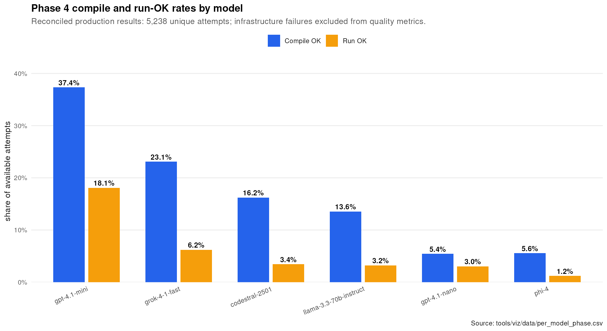
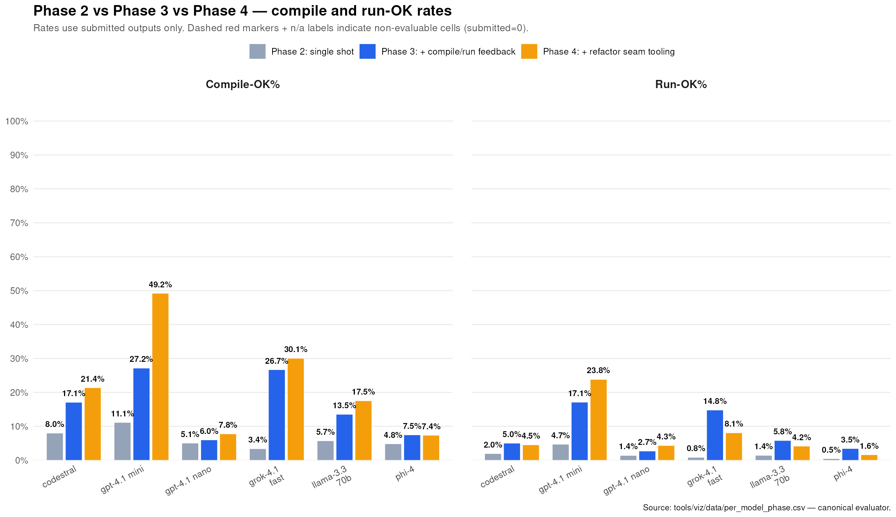
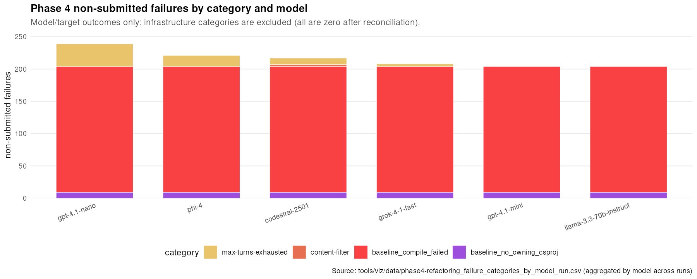

# Phase 4 - Agentic loop + testability refactoring tool: REPORT

> **Status: production results reconciled 2026-08-06.** The retained artifact
> set contains 5,238 unique attempts across six models and three runs. All
> infrastructure-only failures were removed by the completed reruns.

## Per-model results

Percentages use the available attempt count for each model. The historical
artifact snapshot is complete for four models (900 attempts each) and contains
846/900 `gpt-4.1-mini` attempts and 792/900 `gpt-4.1-nano` attempts.

| Model | Attempts | Submitted | Compile OK | Run OK | Compile% | Run% | Applied refactor | Token cost |
|---|---:|---:|---:|---:|---:|---:|---:|---:|
| codestral-2501 | 900 | 683 | 146 | 31 | 16.2% | 3.4% | 0 | $18.88 |
| gpt-4.1-mini | 846 | 642 | 316 | 153 | 37.4% | 18.1% | 0 | $18.03 |
| gpt-4.1-nano | 792 | 553 | 43 | 24 | 5.4% | 3.0% | 0 | $5.26 |
| grok-4-1-fast | 900 | 692 | 208 | 56 | 23.1% | 6.2% | 0 | $6.10 |
| llama-3.3-70b-instruct | 900 | 696 | 122 | 29 | 13.6% | 3.2% | 0 | $29.17 |
| phi-4 | 900 | 679 | 50 | 11 | 5.6% | 1.2% | 1 | $5.23 |
| **Total** | **5,238** | **3,945** | **885** | **304** | **16.9%** | **5.8%** | **1** | **$82.69** |

## Infrastructure reconciliation

The final canonical data has:

- 0 authentication/access failures
- 0 rate-limit failures
- 0 context-length failures
- 0 unsupported API-version failures
- 0 timeout/connection or server-5xx failures

The 1,293 non-submitted attempts are model or target outcomes: 1,170 baseline
compile failures, 54 targets without an owning project, 66 max-tun
exhaustions, and 3 content-filter responses. See
[FAILURE_DIAGNOSTICS.md](FAILURE_DIAGNOSTICS.md) for the per-model/run table.

## Refactoring-capability limitation

These results do **not** provide a valid full-sweep test of the refactoring
hypothesis. The Foundry generation job did not build `RoslynRefactorTool.dll`
during the original sweep, so 5,082 requested refactors were rejected as
`roslyn_tool_missing`.

The corrected workflow built the tool for the final `orleans:0116` rerun. In
that cell, `parameterize_dependency` applied successfully and the modified
owning project built, but the generated test did not compile. Across the
retained sweep:

| Refactor outcome | Count |
|---|---:|
| Rejected: Roslyn tool missing | 5,082 |
| Applied and owning project built | 1 |
| Applied then reverted after build failure | 1 |
| Not applicable to owning project | 1 |
| Invalid transform requested by model | 12 |

Because only one refactor was successfully applied, no run-OK improvement can
be attributed to the refactoring tool. A clean A/B measurement would require a
new full sweep from workflow commit `0252f07c` or later.

## Cross-phase comparison

Using the same canonical aggregation rules:

| Metric | Phase 3 | Phase 4 |
|---|---:|---:|
| Available attempts | 4,954 | 5,238 |
| Submitted | 4,855 | 3,945 |
| Compile OK | 787 (15.9%) | 885 (16.9%) |
| Run OK | 386 (7.8%) | 304 (5.8%) |
| Token cost | $81.80 | $82.69 |

This is an observational comparison, not a refactor-effect estimate, because
the original Phase 4 sweep lacked the refactoring executable.

## Data products

- `results/<model>/run_<n>/attempts.jsonl` - canonical reconciled attempt rows
- `tools/viz/data/per_model_phase.csv` - phase/model summary
- `tools/viz/data/per_model_repo.csv` - Phase 4 model/repository summary
- `tools/viz/data/phase4-refactoring_failure_categories_*.csv` - failure buckets
- `assets/figures/` - rendered report figures

## See also

- [PLAN.md](PLAN.md) - experiment design and anti-gaming rules
- [REPLICATION.md](REPLICATION.md) - replication recipe
- [FAILURE_DIAGNOSTICS.md](FAILURE_DIAGNOSTICS.md) - reconciled failure taxonomy
- [phase 3 REPORT](../phase3-agentic-loop/REPORT.md) - agentic-loop baseline
